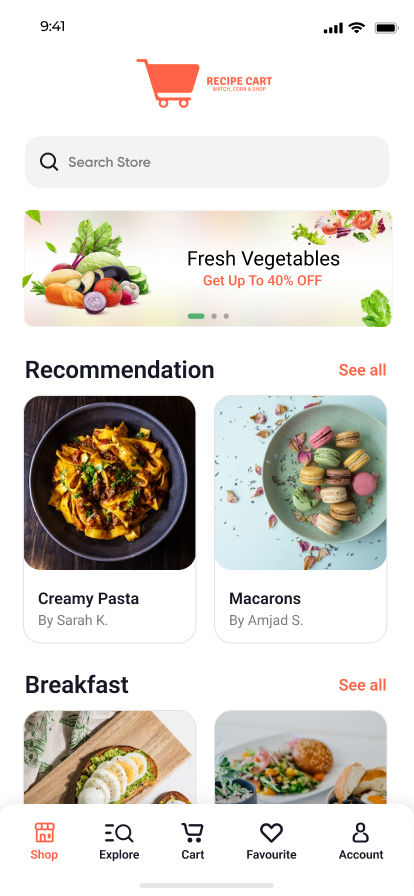
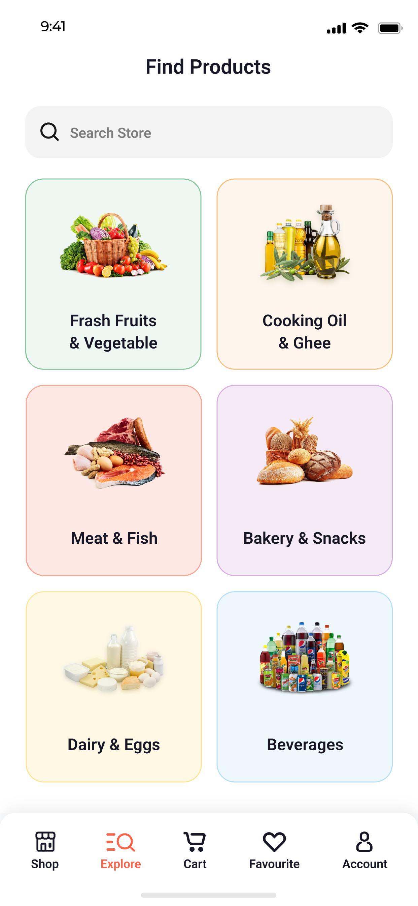
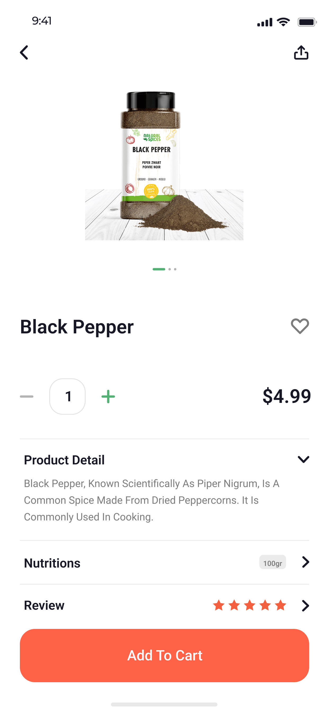
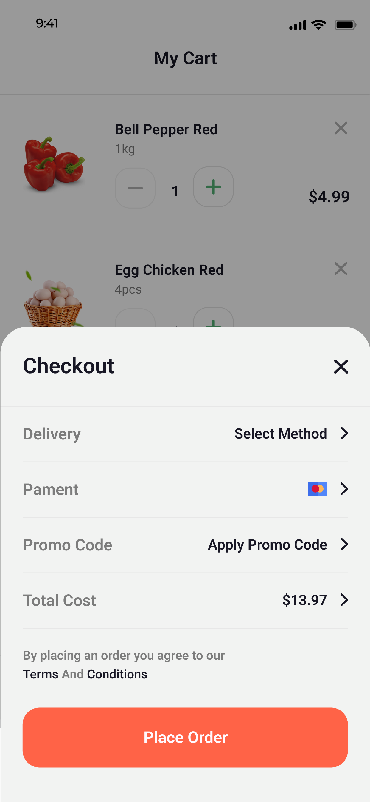

<p align="center">
  
</p>

<h1 align="center">🍲 RecipeCart</h1>

<p align="center">A modern food & grocery app built in Flutter. Watch, cook, and shop your favorite recipes and ingredients with ease.</p>

---

## ✨ Features

- 🔐 User Authentication (Sign In / Sign Up)
- 🛒 Visual product browsing
- 🥗 Recipe detail view with ingredients
- 📦 Add to cart, checkout, and order flow
- ❤️ Favorite items
- 🧾 Profile management
- 📱 Fully responsive design
- 🧭 Bottom navigation bar
- 🎨 Clean UI inspired by modern design principles

---

## 📸 Screenshots

| Home Screen                          | Explore Screen                             | Product Detail                             | Checkout Modal                               |
|--------------------------------------|--------------------------------------------|--------------------------------------------|----------------------------------------------|
|  |  |  |  |

---

## 📁 Folder Structure
lib/
├── main.dart # Entry point of the app
├── constants/ # App constants and colors
├── screens/ # All UI Screens
│ ├── auth/ # Login, Signup, OTP, Splash
│ ├── home/ # Home screen, categories, banners
│ ├── cart/ # My Cart and Checkout Modal
│ ├── account/ # Account related screens
│ └── product/ # Product and Recipe details
├── widgets/ # Reusable widgets
├── routes/ # App route management
├── utils/ # Utility functions (e.g., Toasts)
└── models/ # Data models (if any)

---

## 🛠 Prerequisites

To run this Flutter app on your local machine:

1. **Flutter SDK** (>= 3.10)
    - Install from: https://docs.flutter.dev/get-started/install
2. **Android Studio** or **VS Code**
    - Android Studio: Recommended for full IDE support
    - VS Code: Lightweight alternative with Flutter extension
3. **Xcode (for iOS)** – *MacOS only*
4. **Android Emulator** or physical device connected

---

## 🚀 Getting Started

```bash
# 1. Clone the repository
git clone https://github.com/yourusername/recipe_cart.git
cd recipe_cart

# 2. Get Flutter packages
flutter pub get

# 3. Run the app
flutter run
