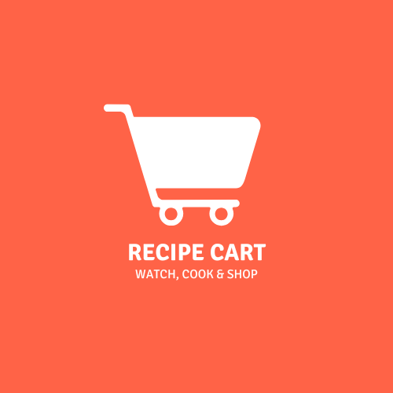

  

<h1 align="center">🍲 RecipeCart</h1>

A modern food & grocery app built in Flutter. Watch, cook, and shop your favorite recipes and ingredients with ease.

---

## ✨ Features

- 🔐 User Authentication (Sign In / Sign Up)
- 🛒 Visual product browsing
- 🥗 Recipe detail view with ingredients
- 📦 Add to cart, checkout, and order flow
- ❤️ Favorite items
- 🧾 Profile management
- 📱 Fully responsive design
- 🧭 Bottom navigation bar
- 🎨 Clean UI inspired by modern design principles

---

## 📸 Screenshots

| Home Screen | Explore Screen | Product Detail | Checkout Modal |
|------------|----------------|----------------|----------------|
|  |  |  |  |

> _Place actual screenshots inside the `/screenshots/` folder and update paths above accordingly._

---

## 📁 Folder Structure

